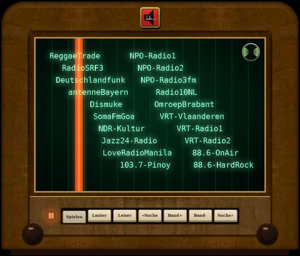

</br>
# RetroWebRadio
## A nice SDL Webradio GUI
[](https://www.youtube.com/watch?v=MMwdwqVnOOw)

## Description
This is a simple mpd webradio SDL frontend which was initially launched by Florian Amrhein (http://amrhein.eu/nw/roehre/ui/).
It is a complete overwork of the initially made version in order to remove bugs and not requiring an external parser.
It shows the stations like the dial of an old tube radio; move the tuner over a station and after one second it starts playing.

The `radio/` folder contains everything needed to build the complete radio on a Raspberry Pi:
three KY-040 rotary encoder daemons (volume, page, tuning), helper scripts and boot/mpd configuration.

## Requirements

- mpd, configured in /etc/mpd.conf, and mpc
- libsdl2-dev, libsdl2-ttf-dev, libxml2-dev, pkg-config

```sh
sudo apt install mpd mpc libsdl2-dev libsdl2-ttf-dev libxml2-dev pkg-config
```

## Setting up mpd

roehre only controls mpd through `mpc`. If mpd is not running, the status line shows
`MPD error: Connection refused` and nothing plays.

```sh
sudo apt install mpd mpc
sudo systemctl enable --now mpd
mpc status          # must answer without an error
```

Once `mpc status` works, roehre starts playing about one second after the tuner stops
on a station.

If you hear nothing, the system mpd usually cannot reach the desktop's sound server.
With PipeWire or PulseAudio, running mpd as a user service with its own configuration
is easier:

```sh
sudo systemctl disable --now mpd
mkdir -p ~/.config/mpd
cat > ~/.config/mpd/mpd.conf <<'EOF'
music_directory "~/Music"
db_file "~/.config/mpd/database"
state_file "~/.config/mpd/state"
audio_output {
    type "pipewire"
    name "PipeWire"
}
EOF
systemctl --user enable --now mpd
```

With PulseAudio use `type "pulse"` instead. If `mpc volume` reports `n/a`, add
`mixer_type "software"` to the `audio_output` block and restart mpd
(`systemctl --user restart mpd`), otherwise volume and mute have no effect.

## Build

```sh
make                 # builds roehre and stations.xml from stationslist.txt
sudo make install    # system-wide (PREFIX=/usr/local): roehre and retrowebradio-tray
                     # in bin/, data in share/retrowebradio, entry in the
                     # application menu (Audio/Video) with the radio icon;
                     # the entry starts the tray icon and shows the radio
sudo make uninstall
```

Without root, `make install-desktop` adds a menu entry for the current user only that runs
`roehre` from this directory (`BINDIR=...` to change). For the Raspberry Pi layout
(everything in one directory) use `make install-pi RADIO_DIR=/home/radio/radio`.

An installed `roehre` looks for `stations.xml` in `~/.config/retrowebradio/` before the
system-wide copy, so every user can keep an own station list.

The window itself always carries the radio icon and the window class `retrowebradio`.

## Tuning static

Like a real receiver, roehre plays static between stations and mixes some static into the
music while the tuner is close to but not exactly on a station; exactly tuned (e.g. after a
scan) it is silent. The static follows the mpd volume and is off while muted or paused.
It is played through SDL's default audio output (PipeWire/PulseAudio). If mpd uses an ALSA
hardware device exclusively, SDL may not get the device; roehre then just runs without
static. `-N` or the `n` key switches it off.

## Stations

Edit `stationslist.txt`, one station per line:

```
[Deutschlandfunk] https://st01.sslstream.dlf.de/dlf/01/128/mp3/stream.mp3
```

Empty lines, lines starting with `#` and lines containing `§` are ignored.
`make` regenerates `stations.xml` (20 stations per page; `make STATIONS_PER_PAGE=16`),
or call `./stationslist2xml.sh [-n per_page] [list.txt] > stations.xml` directly.

## Usage

```
./roehre [-f] [-g|-G] [-N] [-s stations.xml] [-F font.ttf] [-d seconds]
```

| Option | Meaning |
|--------|---------|
| `-f` | fullscreen, scaled to the display with the aspect ratio kept |
| `-g`, `--radio` | the radio: cabinet around the dial, window without frame, cut to the outline of the case (X11), moved by dragging the case, resized at its sides and lower corners |
| `-G`, `--display` | only the display (dial) in a normal window (default for both: as last time) |
| `-N`, `--no-noise` | no static between stations |
| `-s` | station list; default: next to the binary, `./`, `~/.config/retrowebradio/`, `PREFIX/share/retrowebradio` |
| `-F` | TrueType font, searched like `-s` (default `VeraMono.ttf`) |
| `-d` | startup delay in seconds (default 2, avoids starting behind the taskbar at boot) |

| Key | Action |
|-----|--------|
| Left / Right | move the tuner (wraps to the previous/next page) |
| Up / Down | next / previous page |
| r / l | scan to the next station right / left |
| v, +, keypad +, volume-up key | volume +3 |
| -, keypad -, volume-down key | volume -3 |
| m, mute key | mute / unmute (restores the previous volume) |
| p, space, play key | play / pause |
| g | radio cabinet on/off |
| n | tuning static on/off |
| mouse wheel | tune |
| mouse click / touch | put the tuner there |
| q, Esc | quit |

Both views can be resized; the aspect ratio is kept and the size is remembered.

The dial position (page and tuner) is saved in `~/.local/state/retrowebradio/position`
and restored on the next start, so the radio comes back on the last station. If mpd is
already playing that station, it is taken over without re-tuning (no gap).
`SIGUSR1` shows, `SIGUSR2` hides and `SIGRTMIN` toggles the window (used by the tray icon).

## Radio cabinet

Optionally the dial sits in a table radio case in the style of around 1950: walnut box
with rounded top edges, a light veneer frame around a darker front, a figured lower
panel with small labelled ivory push buttons, a neon pilot lamp and two Bakelite knobs. Key `g` or `-g`; the choice is remembered (picture at the top).


Push buttons, left to right: Spielen (play/pause), Lauter (volume +), Leiser (volume −),
«Suche (scan left), Band+ / Band- (next / previous page), Suche» (scan right).
"Spielen" stays pressed down while the radio plays (not paused). The knobs at the lower corners are
step buttons: left knob tunes one step left, right knob one step right, holding repeats.

The pilot lamp (left) is a neon glow lamp: on while the radio plays (also between
stations), off while paused and red when muted.

The dial is backlit: the lettering and lines glow, the tuner is a translucent glowing
bar. The magic eye sits in the top right corner of the dial (in both views); it closes
as the tuner reaches a station, opens between stations and flickers slightly, like the
neon lamp.
The mouse wheel tunes. The labels use DejaVu Serif if installed, else the dial font.

A brass-framed enamel badge with the Niethammer-Audio logo sits at the top centre (generated
into `logo.h` by `textures/mklogo.py`, which traces the logo with potrace to smooth the
lettering).

The veneer comes from photos of a real radio of that time (`textures/*.bmp`, made with
`textures/mktextures.py` from the author's own photo); if the files are missing, a
procedural walnut is drawn instead.

## Tray icon

`retrowebradio-tray` puts a radio icon into the panel's system tray (Gtk.StatusIcon).
For panels that only show AppIndicators (e.g. GNOME with the AppIndicator extension)
start it with `RETROWEBRADIO_TRAY=indicator`.

- left click: menu with "show radio" or "hide radio" (depending on the window state),
  play/pause, louder, quieter, mute, quit
- right click: show/hide the radio window (starts `roehre` if needed; hiding keeps it
  running, so playback continues without a gap)
- middle click: mute on/off, scroll wheel: volume
- "Quit" closes the radio GUI, stops playback (`mpc stop`) and ends the tray
- menu in German when the locale is German, English otherwise
- the icon gets a pause badge when paused or stopped, is crossed out when muted and grey
  when mpd is not reachable; the tooltip
  shows volume and title, updated immediately via `mpc idleloop`

```sh
sudo apt install python3-gi gir1.2-ayatanaappindicator3-0.1
./retrowebradio-tray &
```

It starts `roehre` from its own directory (or from `$PATH`). `retrowebradio-tray --show`
(used by the menu entry) also shows the radio window; if the tray is already running,
it only brings up the window instead of starting a second tray. `--radio` / `--display`
switch a running radio to that view (the menu entry offers both as actions). For autostart, add
`/path/to/retrowebradio-tray` to the desktop session's startup applications.
