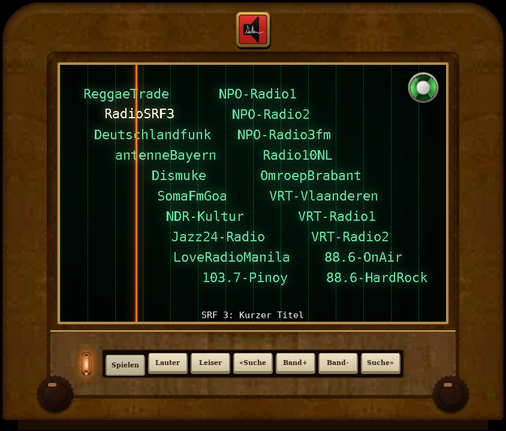

</br>

# RetroWebRadio
## A nice SDL Webradio GUI

`roehre` is an [mpd](https://www.musicpd.org/) web radio frontend that shows the stations
like the dial of an old tube radio: move the tuner over a station and after one second it
starts playing. It was initially launched by Florian Amrhein
(http://amrhein.eu/nw/roehre/ui/) and has been reworked completely since.

[Video of the first version](https://www.youtube.com/watch?v=MMwdwqVnOOw)

- backlit dial with a glowing needle, magic eye ("Empfang") and tuning static between
  stations, like a real receiver
- optional radio cabinet in the style of around 1950 (walnut veneer from photos of a real
  radio, labelled push buttons, neon pilot lamp, knobs, brass logo badge), frameless and
  cut to the outline of the case
- cover view with the album art of the current title
- tray icon, application menu entry, control FIFO for scripts and hardware knobs
- remembers station, view and window size
- the `radio/` folder builds a stand-alone radio on a Raspberry Pi with three rotary
  knobs, see [radio/README.md](radio/README.md)

## Requirements

```sh
sudo apt install mpd mpc libsdl2-dev libsdl2-ttf-dev libxml2-dev pkg-config \
     libx11-dev libxext-dev python3-pil python3-gi gir1.2-ayatanaappindicator3-0.1
```

`libx11-dev`/`libxext-dev` are optional (window cut to the case outline on X11),
`python3-pil` is needed for the cover view, `python3-gi` for the tray icon.

## Setting up mpd

roehre controls mpd through `mpc`. If mpd is not running, the status line shows
`MPD error: Connection refused` and nothing plays.

```sh
sudo systemctl enable --now mpd
mpc status          # must answer without an error
```

On a desktop with PipeWire (current Ubuntu, Debian, Raspberry Pi OS) the system mpd often
cannot use the sound card ("Device or resource busy") because PipeWire holds it. Run mpd
as a user service with PipeWire output instead:

```sh
sudo systemctl disable --now mpd.service mpd.socket
mkdir -p ~/.config/mpd ~/.local/share/mpd
cat > ~/.config/mpd/mpd.conf <<'EOF'
music_directory  "~/Music"
db_file          "~/.local/share/mpd/database"
state_file       "~/.local/share/mpd/state"
bind_to_address  "any"
audio_output {
    type        "pipewire"
    name        "PipeWire"
    mixer_type  "software"
}
EOF
systemctl --user enable --now mpd
loginctl enable-linger $USER      # also without a login
```

With PulseAudio use `type "pulse"`. Without `mixer_type "software"` `mpc volume` may
report `n/a`, and volume and mute have no effect. An ALSA equalizer in front of PipeWire is
described in [radio/README.md](radio/README.md).

## Build and install

```sh
make                  # roehre and stations.xml from stationslist.txt
sudo make install     # system-wide (PREFIX=/usr/local) with application menu entry
sudo make uninstall
```

`make install` puts `roehre`, `retrowebradio-tray` and `retrowebradio-cover` into
`PREFIX/bin`, font, stations, icons and textures into `PREFIX/share/retrowebradio`, and a
menu entry (Audio/Video) that starts the tray icon and shows the radio; its actions
"Radio" and "Nur Display" open the respective view.

| Target | |
|--------|-|
| `make install-desktop` | menu entry for the current user only, running roehre from this directory (`BINDIR=...`) |
| `make install-pi` | everything in one directory, `RADIO_DIR` (default `/home/radio/radio`) |
| `make autostart` | Raspberry Pi: knob daemon, radio at login, mpd user service (see radio/README.md) |

An installed `roehre` looks for `stations.xml` in `~/.config/retrowebradio/` before the
system-wide copy, so every user can keep an own station list. `PREFIX` is compiled into
roehre; run `make clean` after changing it.

## Stations

Edit `stationslist.txt`, one station per line:

```
[Deutschlandfunk] https://st01.sslstream.dlf.de/dlf/01/128/mp3/stream.mp3
```

Empty lines, lines starting with `#` and lines containing `§` are ignored. `make`
regenerates `stations.xml` (20 stations per page, `make STATIONS_PER_PAGE=16`), or call
`./stationslist2xml.sh [-n per_page] [list.txt] > stations.xml`.

## Usage

```
roehre [-f] [-g|-G] [-N] [-s stations.xml] [-F font.ttf] [-d seconds]
```

| Option | Meaning |
|--------|---------|
| `-f`, `--fullscreen` | fullscreen, scaled with the aspect ratio kept |
| `-g`, `--radio` | the radio: cabinet around the dial |
| `-G`, `--display` | only the display (dial) |
| `-N`, `--no-noise` | no static between stations |
| `-s`, `--stations` | station list (next to the binary, `./`, `~/.config/retrowebradio/`, `PREFIX/share/retrowebradio`) |
| `-F`, `--font` | TrueType font, searched like `-s` (default `VeraMono.ttf`) |
| `-d`, `--delay` | startup delay in seconds (default 2, avoids starting behind the taskbar at boot) |

Without `-g`/`-G` the view of the last run is used.

| Key / mouse | Action |
|-------------|--------|
| Left / Right, mouse wheel | move the tuner (wraps to the previous/next page) |
| Up / Down | next / previous page |
| r / l | scan to the next station right / left |
| click / touch on the dial | put the tuner there |
| +, keypad +, volume key | volume +3 |
| -, keypad -, volume key | volume -3 |
| m, mute key | mute / unmute (restores the previous volume) |
| p, space, play key | play / pause |
| v | cover view on/off |
| g | radio cabinet on/off |
| n | tuning static on/off |
| q, Esc | quit |

Both views can be resized; the aspect ratio is kept and the size is remembered. When the
window manager maximizes the window (e.g. dragged to the top edge), the radio is drawn as
large as fits and centred.

Page, tuner position, view and size are saved in `~/.local/state/retrowebradio/position`.
The radio comes back on the last station; if mpd is already playing it, it is taken over
without re-tuning (no gap).

## Radio cabinet

With `g` or `-g` the dial sits in a table radio case in the style of around 1950 (picture at
the top). The window has no frame and is cut to the outline of the case (X11); drag the case
to move it, drag its sides or lower corners to resize it.

- **Push buttons**: Spielen (play/pause, stays down while playing), Lauter, Leiser,
  «Suche (scan left), Band+ / Band- (next / previous page), Suche» (scan right)
- **Knobs** at the lower corners: step buttons, left one step left, right one step right,
  holding repeats
- **Pilot lamp**: a neon glow lamp seen from the top, on while the radio plays, off while
  paused, red when muted
- **Badge**: the Niethammer-Audio logo in a brass-framed enamel badge

The veneer comes from photos of a real radio of that time (`textures/*.bmp`, made with
`textures/mktextures.py` from the author's own photo); if the files are missing, a
procedural walnut is drawn. The badge is generated into `logo.h` by `textures/mklogo.py`
(potrace smooths the lettering). The key labels use DejaVu Serif if installed.

## Dial

The dial is backlit: the lettering and lines glow softly, the tuner is a narrow glowing
needle. The magic eye ("Empfang", top right, in both views) closes as the tuner reaches a
station and opens between stations.

**Tuning static**: between stations roehre plays static, near a station it mixes some static
into the music, exactly tuned it is silent. It follows the mpd volume and is off while
muted or paused. It goes through SDL's default audio output (PipeWire/PulseAudio); if there
is none, roehre runs without it. `-N` or `n` switches it off.

**Cover view**: `v` shows the album art of the current title instead of the stations. The
helper `retrowebradio-cover` looks the song up with the iTunes Search API (no account or key
needed), fits the artwork to 300x300 and caches it in `~/.cache/retrowebradio/covers`.
While it is searching, and for news, jingles or stations that send no "Artist - Title", the
normal dial stays visible.

## Tray icon

`retrowebradio-tray` puts a radio icon into the panel's system tray (for panels that only
show AppIndicators: `RETROWEBRADIO_TRAY=indicator`).

- left click: menu with "Radio anzeigen" / "Radio verbergen" (by window state),
  play/pause, louder, quieter, mute, quit
- right click: show / hide the radio (starts it if needed; hiding keeps it playing)
- middle click: mute, scroll wheel: volume
- "Beenden" closes the radio, stops playback and ends the tray
- the icon shows pause, mute (crossed out) and mpd offline (grey); the tooltip shows
  volume and title
- German menu with a German locale, English otherwise

`retrowebradio-tray --show [--radio|--display]` (used by the menu entry) starts the tray
if needed and shows the radio in that view; a second call only brings up the window.

## Control FIFO and signals

roehre reads commands, one per line, from `$XDG_RUNTIME_DIR/retrowebradio.ctl`:

```sh
echo "scan +1" > $XDG_RUNTIME_DIR/retrowebradio.ctl
```

`tune +N|-N`, `scan +1|-1`, `page +1|-1`, `volume +N|-N`, `play`, `mute`, `cover`, `show`,
`hide`, `toggle`, `radio`, `display`. This works on X11 and Wayland and with a hidden
window; the knob daemon `radio/potid.py` uses it. In addition `SIGUSR1` shows, `SIGUSR2`
hides and `SIGRTMIN` toggles the window.

## License

GPL-3.0, see [LICENSE](LICENSE).
